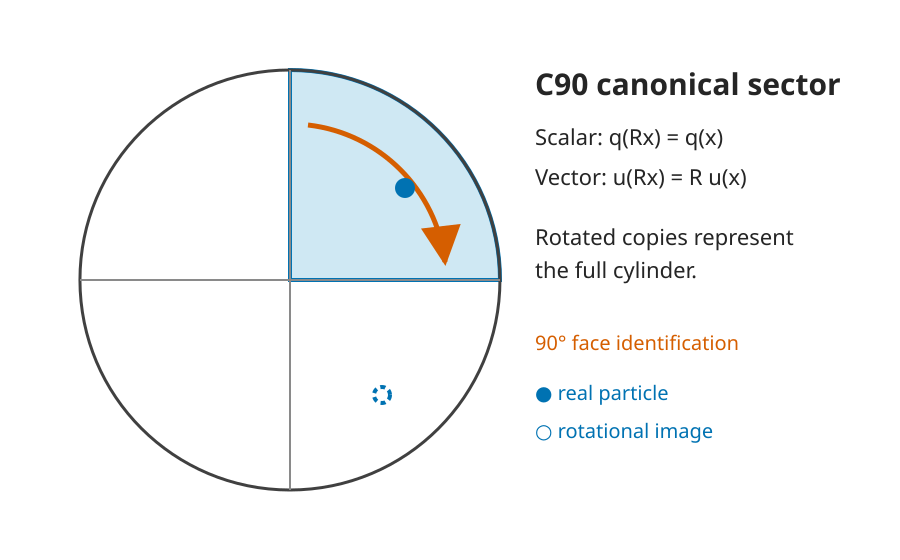
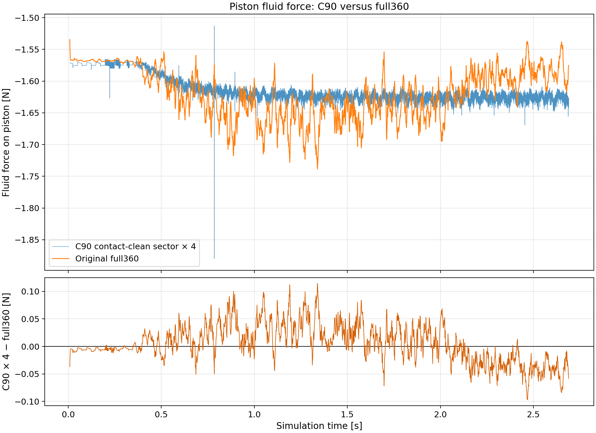
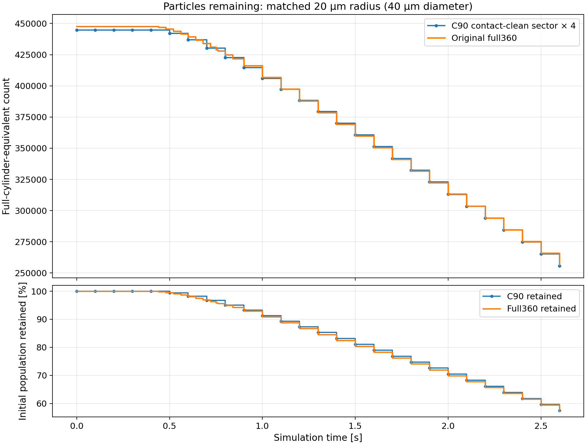

# C90 rotational-sector simulation

This repository documents the formulation and validation of a 90-degree
rotationally periodic sector for a coupled gas–particle cylinder calculation.
Four rotated copies of the computational sector represent a full cylinder
when the geometry, boundary data, and initial state have fourfold rotational
symmetry.

The project focuses on five coupled requirements:

- scalar fields map between the radial faces;
- vectors rotate by 90 degrees when they cross a face;
- particles wrap into the canonical sector and interact through rotational
  images;
- fluxes and particle-to-fluid sources remain conservative; and
- the pressure projection acts on the rotational quotient space.

This is a clean-room technical portfolio. It contains mathematical
descriptions, sanitized results, figures, and independent plotting tools. It
does **not** distribute the underlying simulation source, proprietary input
decks, executables, checkpoints, or raw logs.

The underlying research used private modifications to a separately obtained
MFiX-Exa source tree. Those modifications are intentionally not included.
See the [source and affiliation notice](NOTICE.md) for the distribution and
licensing boundary.



## Validation snapshot

The strongest accepted results include:

- fine quotient-operator action agreement of `1.62e-10` globally for an
  exactly fourfold-symmetric reference field;
- particle wrap and cyclic-contact symmetry errors between `6.897e-13` and
  `1.297e-14` in focused one-GPU tests;
- a cross-rank cyclic-seam contact symmetry error of `2.780e-15`;
- a focused tangential-history seam test agreeing with its rotated interior
  reference to `1.126e-13` maximum absolute vector error;
- mature one-GPU throughput of `0.363756838 s/step` over 100 fluid steps; and
- a separate large-particle campaign with profiling-guided DEM optimizations,
  including a qualified 52.78% reduction in normalized DEM-substep time from
  spatial sorting; and
- full-cylinder-equivalent force-ledger closure to `1.11022e-15 N`.

Scope matters: published coupled production results use one MPI rank.
Focused two-rank particle tests and a one-step coupled comparison pass, but
sustained coupled multi-rank pressure evolution is not qualified.

## C90 versus full cylinder

The following user-selected figures are included as interim visual
comparisons. They provide qualitative project context and are not used for
the quantitative validation claims in this repository.





The repository also includes a measured-only particle-population dataset over
the common interval through approximately `0.84 s`, along with an independent
plotting script.

## Repository map

- [`docs/formulation.md`](docs/formulation.md) — rotational mapping and
  quotient-space formulation.
- [`docs/implementation-overview.md`](docs/implementation-overview.md) —
  architecture-level design without restricted implementation detail.
- [`docs/validation-methods.md`](docs/validation-methods.md) — metrics,
  normalization, and evidence scope.
- [`docs/validation-results.md`](docs/validation-results.md) — accepted,
  sanitized result tables.
- [`docs/gpu-performance.md`](docs/gpu-performance.md) — GPU optimization
  strategy, profiling methodology, and performance/accuracy tradeoffs.
- [`docs/limitations.md`](docs/limitations.md) — unresolved and unqualified
  behavior.
- [`data/README.md`](data/README.md) — public data schemas.
- [`scripts/README.md`](scripts/README.md) — figure reproduction.
- [`provenance/release-manifest.md`](provenance/release-manifest.md) — artifact
  status and release boundary.
- [`NOTICE.md`](NOTICE.md) — MFiX-Exa source, licensing, and affiliation
  boundary.
- [`CONTRIBUTING.md`](CONTRIBUTING.md) — clean-room contribution rules.

## Reproduce the measured particle figures

```bash
python3 -m pip install matplotlib
python3 scripts/plot_particle_population.py \
  --retention-csv data/sanitized/particle_retention_timeseries.csv \
  --count-csv data/sanitized/particle_count_timeseries.csv \
  --output-dir build/figures
```

Run the public-data and release-hygiene checks with:

```bash
python3 -m unittest discover -s tests -v
python3 scripts/check_release.py
```

## Status

This local tree is approved for Git preparation. The two comparison figures
are intentionally retained as interim qualitative context. No MFiX-Exa source
or private source modification is included.
