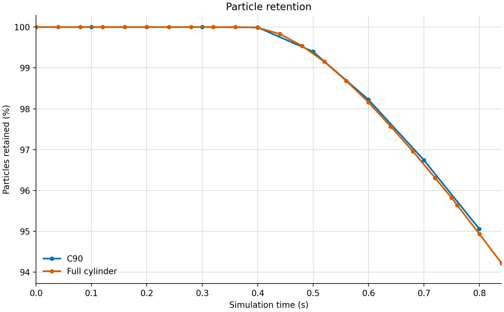

# Validation results

## Focused operator and particle tests

| Test | Metric | Result | Scope |
|---|---|---:|---|
| Quotient-operator action | Global relative error | `1.62e-10` | Exactly fourfold-symmetric reference field |
| Quotient-operator action | Owner-line relative error | `2.18e-11` | Exactly fourfold-symmetric reference field |
| Quadrant particle wrap | Maximum state error | `6.897e-13` | Focused one-GPU test |
| Normal cyclic-seam contact | Relative speed-symmetry error | `1.297e-14` | Focused one-GPU test |
| Near-axis canonicalization | Maximum state error | `9.959e-14` | Focused one-GPU test |
| Particle-only restart | Maximum final-state difference | `0.0` | Two particle steps |
| Cross-rank cyclic-seam contact | Relative speed-symmetry error | `2.780e-15` | Focused two-rank, two-GPU normal-contact test |
| Cross-rank tangential history | Maximum absolute vector error | `1.126e-13` | Focused two-rank, two-GPU two-particle test |
| Cross-rank tangential history | Maximum relative vector error | `1.002e-13` | Focused two-rank, two-GPU two-particle test |

## One-step coupled MPI correctness

| Metric | One-rank versus two-rank difference |
|---|---:|
| Full-cylinder-equivalent piston-force relative difference | `3.955103649e-9` |
| Particle-position RMS / maximum | `6.183325213e-17 / 6.778038315e-16 m` |
| Particle-velocity RMS / maximum | `6.118785173e-12 / 6.080914339e-11 m/s` |
| Particle angular-velocity RMS / maximum | `0 / 0 1/s` |
| Retained particle IDs | `111,184` |

This is a one-step, one-node correctness comparison, not a multi-step pressure
parity, speedup, or production-duration result.

## Pre-contact coupled restart

| Metric | Continuous versus restarted difference |
|---|---:|
| Particle-position RMS / maximum | `4.04243e-12 / 1.46290e-11 m` |
| Particle-velocity RMS / maximum | `1.59732e-7 / 7.98024e-7 m/s` |
| Particle angular-velocity RMS / maximum | `0 / 0 1/s` |
| Full-cylinder-equivalent piston-force absolute difference | `9.88559e-5 N` |
| Full-cylinder-equivalent piston-force relative difference | `0.00656301%` |
| Retained particles | `111,184` |

## Conservation diagnostics

| Diagnostic | Result |
|---|---:|
| Force-ledger closure, C90 sector | `1.66533e-16 N` |
| Force-ledger closure, full-cylinder equivalent | `1.11022e-15 N` |
| Five-plane mass-flow spread, mean | `0.20846%` |
| Five-plane mass-flow spread, startup maximum | `0.61985%` |
| Five-plane mass-flow spread, final sample | `0.0439473%` |

Force-ledger closure is an algebraic balance, not a complete energy or mass
conservation proof. The plane-flow result is a short-run uniformity
diagnostic, not a formal convergence study.

## Static embedded-boundary matrix

Six static geometry cases cover four lower-face orientations and three
transverse resolutions. Every case contains both cyclic faces and finite
fractional cells, passes the focused geometry and flux checks, and produces a
distinct sampled cut-cell pattern. Sampled partial volume fractions span
`0.0023700923` to `0.93782217`. This is static geometry evidence; it does not
qualify moving cut-cell topology.

## Mature-window C90 timing

| Evidence series | Window | Total | Fluid | Particles | Coupling | Nodal solve |
|---|---|---:|---:|---:|---:|---:|
| Qualification | 100 fluid steps | `0.363756838 s/step` | `0.265633965` | `0.079816885` | `0.016893967` | `0.069875217` |
| Independent reproduction | 100 fluid steps | `0.366873283 s/step` | — | — | — | — |
| Independent reproduction | Last 20 steps | `0.370577036 s/step` | — | — | — | — |
| Independent reproduction | Last 10 steps | `0.373389782 s/step` | — | — | — | — |

Both series use one H100 and one MPI rank. Component timers can overlap.

## Balanced-versus-strict C90 accuracy

| Metric | Result |
|---|---:|
| Piston pressure-drop mean / maximum absolute error | `0.0382906 / 0.0713978%` |
| Wall-pressure mean / maximum absolute error | `0.434781 / 2.04477%` |
| Particle-position RMS / maximum | `1.85155e-6 / 7.17034e-5 m` |
| Particle-velocity RMS / maximum | `0.00229884 / 0.0844885 m/s` |
| Particle angular-velocity RMS / maximum | `994.747 / 2.91499e4 1/s` |
| Retained particles | `111,907` |

The comparator is a stricter C90 calculation initialized from the same state,
not a full-cylinder calculation.

## Measured particle population

The common measured interval ends at `0.840015 s`. Initial
full-cylinder-equivalent C90 and native full-cylinder populations are
`444,736` and `447,628`. At the native samples nearest `0.8 s`, retention is
`95.05864%` for C90 and `94.93508%` for the full cylinder.

